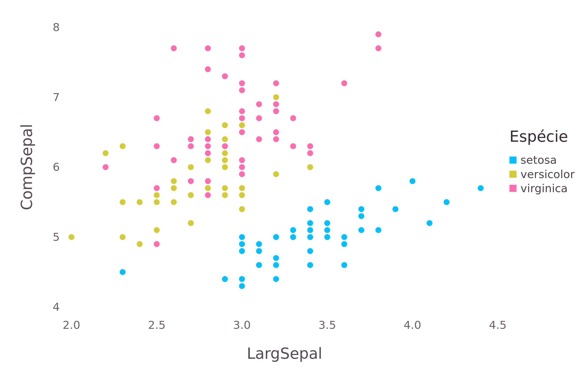

## Título | Subtítulo

Lorem Ipsum

- Tópico 1
- Tópico 2

## Segundo Slide 

Incrementação de slides: 

> - Tópico 1
> - Tópico 2

Use incremental: true ou "> -" para listar por slide. 

## Terceiro Slide

Para aumentar a velocidade de transição dos slides, use "faster", "slower" ou "default"
em transition. Note que transition assume valores numéricos também, podendo variar
em *segundos*.

## Realçar códigos
    

<b>
x <- 10
</b>

## Logos

adicionar logo: caminho da imagem no preâmbulo.


## Tags HTML

<div class="centered">
  Centralizado.
</div>

## Adicionar imagem

<div class="columns-2">



- Tópico 1

- Tópico 2
</div>

## Colorindo textos 

<div class="red2">
Este texto é vermelho
</div>

<div class="blue">
Este texto é azul
</div>

<font color="green">
Este texto é verde
</font color> 

## Código em r

```{r, echo=FALSE, fig.align='center', fig.height=10}

plot(iris,col=2)

```